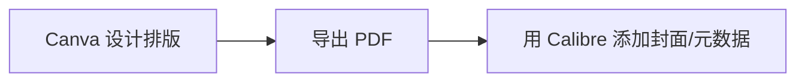
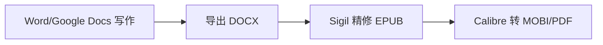

# 如何制作精美漂亮的PDF，有哪些常用的工具？

制作精美漂亮的 PDF 有多种方式，取决于你的内容类型（如报告、简历、宣传册、电子书等）、设计需求以及技术熟练程度。以下是一些常用工具和建议：

---

## 一、常用工具推荐

### 1. **专业排版与设计工具**
适合对排版、字体、图像、色彩有高要求的用户。

- **Adobe InDesign**  
  - 行业标准，适合制作杂志、宣传册、电子书等复杂排版。
  - 导出高质量 PDF，支持 CMYK、出血、嵌入字体等专业功能。
  - 缺点：付费软件，学习曲线较陡。

- **Affinity Publisher**（Mac/Windows）  
  - 功能接近 InDesign，但价格更亲民（一次性买断）。
  - 支持高质量 PDF 导出，适合专业排版。

- **Canva**（在线）  
  - 模板丰富，操作简单，适合非设计师快速制作美观 PDF（如简历、海报、报告）。
  - 免费版可用，高级模板需 Pro 订阅。
  - 导出为 PDF（可选带出血或标准格式）。

- **Figma**（在线/UI 设计工具）  
  - 虽主要用于 UI/UX 设计，但也可用于制作视觉精美的 PDF 报告或提案。
  - 可导出为 PDF，支持矢量图形、高分辨率。

---

### 2. **办公与文档工具**
适合以文字为主、结构清晰的内容（如报告、论文、简历）。

- **Microsoft Word**  
  - 使用样式、主题、封面页、目录等功能提升美观度。
  - “另存为 PDF”即可，注意嵌入字体、设置高分辨率图像。
  - 技巧：使用专业模板（如 Office 模板库或第三方如 Envato Elements）。

- **Google Docs**  
  - 简洁易用，支持导出 PDF。
  - 美观度有限，但搭配好字体（如 Google Fonts）和布局也能做出清爽效果。

- **LaTeX**（适合学术/技术文档）  
  - 用代码排版，输出极其专业、一致的 PDF（常见于论文、书籍）。
  - 工具：Overleaf（在线）、TeX Live（本地）。
  - 学习成本高，但排版质量无与伦比。

---

### 3. **编程/自动化工具**（适合开发者或批量生成）

- **HTML + CSS → PDF**  
  - 使用工具如 **Puppeteer**（Node.js）、**WeasyPrint**（Python）、**wkhtmltopdf**。
  - 优势：可动态生成、样式灵活（用现代 CSS 控制布局）。
  - 适合生成发票、报告、证书等。

- **Markdown → PDF**  
  - 工具：**Pandoc** + LaTeX / **Typora** / **Obsidian**（配合插件）。
  - 适合写作者，兼顾简洁与美观。

---

## 二、提升 PDF 美观度的通用技巧

1. **统一字体与配色**  
   - 使用 1–2 种字体（如标题用无衬线体，正文用衬线体）。
   - 配色不超过 3 种主色，可用工具如 Coolors 或 Adobe Color。

2. **留白与对齐**  
   - 避免内容拥挤，合理使用页边距和段落间距。
   - 所有元素对齐（左对齐最常见，居中慎用）。

3. **高质量图片**  
   - 使用 300 DPI（印刷）或 150+ DPI（屏幕）图像。
   - 避免拉伸变形，统一图片风格（如圆角、阴影）。

4. **添加交互元素（可选）**  
   - 超链接、目录跳转、书签、表单字段（用 Adobe Acrobat Pro 编辑）。

5. **优化文件大小**  
   - 压缩图像（如用 Adobe Acrobat 的“优化 PDF”功能）。
   - 避免嵌入过多字体。

---

## 三、推荐工作流示例

| 需求类型         | 推荐工具                     |
|------------------|------------------------------|
| 专业宣传册/杂志  | Adobe InDesign / Affinity Publisher |
| 快速简历/海报    | Canva / Figma                |
| 学术论文         | LaTeX (Overleaf)             |
| 企业报告         | Word + 专业模板 / PowerPoint 导出 PDF |
| 自动化批量生成   | HTML + Puppeteer / WeasyPrint |

---

## 四、免费资源

- **模板网站**：Canva、Envato Elements、Freepik、Template.net
- **字体**：Google Fonts、Adobe Fonts（需订阅）、Font Squirrel
- **图标/插图**：Flaticon、Undraw、Heroicons

---

总结：  
> **“内容为王，设计为后”** —— 先确保内容清晰有价值，再通过合适的工具和设计原则提升视觉体验。

如果你有具体用途（比如“想做一份求职简历”或“制作产品手册”），我可以提供更针对性的建议！

# 我是想制作电子书，有哪些工具可以提高制作效率

制作电子书（eBook）时，选择合适的工具不仅能提升排版美观度，还能大幅提高效率，尤其是当你需要频繁更新、多格式输出（如 PDF、EPUB、MOBI）或包含图文混排、目录、索引等结构化内容时。

以下是针对**电子书制作**的高效工具与工作流建议，按不同需求分类：

---

## 一、推荐工具（按效率与适用场景分类）

### ✅ 1. **Markdown + Pandoc（高效率、开发者/写作者友好）**
- **适用人群**：喜欢简洁写作、希望一次编写多格式输出的用户。
- **优势**：
  - 用纯文本写作（无干扰），专注内容。
  - 通过 **Pandoc** 一键转换为 PDF、EPUB、MOBI、HTML 等格式。
  - 支持目录、脚注、引用、代码块、数学公式等。
- **推荐组合**：
  - 编辑器：**Typora**（所见即所得）、**Obsidian**、**VS Code + Markdown 插件**
  - 转换工具：**Pandoc**（需安装 LaTeX 用于 PDF 输出）
  - 模板：使用 `eisvogel`（LaTeX 模板）生成精美 PDF
- **效率亮点**：修改一次源文件，自动更新所有格式。

> 📌 示例命令：  
> `pandoc book.md -o book.pdf --template eisvogel --toc --number-sections`

---

### ✅ 2. **Sigil（专为 EPUB 设计的免费开源工具）**
- **适用人群**：需要精细控制电子书结构（如目录、元数据、CSS 样式）的用户。
- **优势**：
  - 可视化编辑 EPUB（类似 Word + 代码视图）。
  - 自动生成目录、修复格式、嵌入字体。
  - 支持正则批量替换，适合后期优化。
- **适合场景**：将已有内容（如 Word 或 HTML）转为标准 EPUB，并优化阅读体验（适配 Kindle、Apple Books 等）。

---

### ✅ 3. **Canva（快速制作图文并茂的 PDF 电子书）**
- **适用人群**：非技术用户，注重视觉设计（如营销类电子书、指南、作品集）。
- **优势**：
  - 拖拽式操作，海量模板（搜索 “eBook” 或 “digital book”）。
  - 内置图片、图标、字体，一键导出高清 PDF。
- **局限**：仅输出 PDF，不适合 Kindle 等设备阅读（无流式排版）。
- **技巧**：设置页面尺寸为 A4 或自定义（如 6×9 英寸标准电子书尺寸）。

---

### ✅ 4. **Google Docs + Add-ons（协作友好、云端写作）**
- **适用人群**：团队协作写书、需要实时反馈的作者。
- **提升效率插件**：
  - **Doc2Epub**：直接导出 EPUB。
  - **Table of Contents**：自动生成目录。
  - 使用样式（标题 1/2/3）确保结构清晰。
- **导出流程**：  
  Google Docs → 下载为 DOCX → 用 Calibre 转为 EPUB/PDF

---

### ✅ 5. **Calibre（电子书管理 + 格式转换神器）**
- **核心用途**：**不是写作工具，而是后期处理利器**。
- **高效功能**：
  - 批量转换格式（DOCX/HTML → EPUB/PDF/MOBI）
  - 编辑元数据（封面、作者、ISBN）
  - 优化排版、嵌入字体、压缩图片
  - 内置电子书阅读器，预览效果
- **建议流程**：先用其他工具写内容 → 用 Calibre 转换并优化 → 发布

---

### ✅ 6. **LaTeX（学术/技术类电子书首选）**
- **适用场景**：含大量公式、图表、参考文献的书籍（如教材、论文集）。
- **工具**：Overleaf（在线）、TeXstudio（本地）
- **优势**：自动编号、交叉引用、专业排版。
- **输出**：高质量 PDF，也可通过 `tex4ebook` 转为 EPUB。

---

## 二、高效工作流推荐

### 📚 场景 1：纯文字/技术类电子书（如编程教程、知识手册）

### 📚 场景 2：图文并茂的营销电子书（如行业指南、作品集）

### 📚 场景 3：传统出版风格电子书（需适配 Kindle/iBooks）

---

## 三、提升效率的实用技巧

1. **统一源文件管理**  
   - 所有图片、章节文件放在一个项目文件夹，避免路径混乱。

2. **自动化脚本**  
   - 用 Shell/Python 脚本自动运行 Pandoc + Calibre，一键生成多格式。

3. **使用模板**  
   - Markdown：`eisvogel.latex`（PDF）、`pandoc-epub-template`
   - Canva：搜索 “Professional eBook Template”

4. **预览与测试**  
   - 用 Kindle Previewer（亚马逊官方工具）测试 MOBI 效果。
   - 用 Apple Books / Google Play Books 测试 EPUB。

5. **版本控制**  
   - 用 Git 管理电子书源文件（尤其适合多人协作或长期更新）。

---

## 四、工具对比速查表

| 工具        | 适合类型       | 多格式输出 | 学习成本 | 免费 |
|-------------|----------------|------------|----------|------|
| Markdown+Pandoc | 技术/知识类   | ✅ 强       | 中       | ✅   |
| Sigil       | 小说/EPUB精修  | ✅（EPUB为主）| 中       | ✅   |
| Canva       | 营销/视觉类    | ❌（仅PDF） | 低       | ✅（基础）|
| Google Docs | 协作写作       | ⚠️ 需插件   | 低       | ✅   |
| Calibre     | 格式转换/优化  | ✅ 极强     | 低       | ✅   |
| LaTeX       | 学术/公式密集  | ✅（PDF为主）| 高       | ✅   |

---

## 五、推荐组合（兼顾效率与美观）

> **“写作用 Markdown，设计用模板，转换用 Calibre”**

1. 写作：**Typora / Obsidian**（Markdown）
2. 排版美化：**Pandoc + eisvogel 模板**（PDF）或 **Sigil**（EPUB）
3. 最终处理：**Calibre**（统一格式、压缩、添加封面）

---

如果你能告诉我：
- 电子书类型（小说？教程？画册？）
- 目标平台（PDF下载？Kindle？App内阅读？）
- 是否含大量图片/公式/代码？

我可以为你定制一套**最适合的高效制作方案**！

