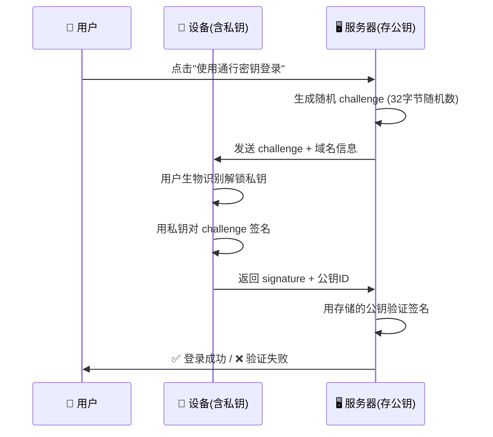

# 现在很多网站开始支持用Passkey登录，请给我解释一下Passkey的工作原理，它与其他方式相比的优势，安全性如何？

# 🔐 Passkey（通行密钥）详解：工作原理、优势与安全性分析

## 📋 什么是Passkey？

Passkey（通行密钥）是一种基于 **FIDO2/WebAuthn 标准** 的无密码身份验证技术，由 Apple、Google、Microsoft 等科技巨头联合推动，旨在用更安全的加密凭证替代传统密码 [[1]][[2]]。

---

## ⚙️ 工作原理：非对称加密 + 挑战-应答

### 核心机制

```
┌─────────────────┐         ┌─────────────────┐
│   用户设备       │         │   网站服务器     │
│                 │         │                 │
│  🔐 私钥        │◄───────►│  🔓 公钥        │
│  (永不离开设备)  │   同步   │  (仅用于验证)   │
│                 │         │                 │
└─────────────────┘         └─────────────────┘
```

### 注册流程
1. 用户在网站点击"创建通行密钥"
2. 设备生成**唯一密钥对**（公钥+私钥）
3. **公钥**发送至服务器存储，**私钥**安全保存在设备的安全芯片（如 Secure Enclave/TPM）
4. 密钥与**网站域名（RP ID）绑定**，实现源绑定防钓鱼 [[3]][[7]]

### 登录流程
1. 网站发送随机"挑战"(challenge)给设备
2. 用户通过**生物识别/设备PIN**解锁私钥
3. 私钥对挑战进行**数字签名**并返回
4. 服务器用公钥验证签名，验证通过即登录成功 [[4]][[6]]

> 🔑 关键点：私钥**永远不会离开用户设备**，服务器只存储无法反推私钥的公钥 [[1]]

---

## 🛡️ 安全性分析：为什么比密码更安全？

| 攻击类型 | 传统密码 | 密码管理器 | Passkey |
|---------|---------|-----------|---------|
| 🔗 网络钓鱼 | ❌ 极易中招 | ❌ 可被诱导填充 | ✅ 源绑定，跨域无效 |
| 🔄 撞库攻击 | ❌ 密码复用高风险 | ⚠️ 仍有复用风险 | ✅ 每站点唯一密钥 |
| 💾 数据库泄露 | ❌ 密码哈希可被破解 | ⚠️ 主密码泄露即全失 | ✅ 公钥泄露无危害 |
| 🔐 暴力破解 | ❌ 在线猜解可行 | ⚠️ 依赖主密码强度 | ✅ 无在线验证入口 |
| 🎭 社会工程 | ❌ 用户易被骗 | ❌ 仍依赖用户判断 | ✅ 需本地生物验证 |

### 核心安全优势

1. **原生防钓鱼**：密钥与网站域名绑定，恶意网站无法通过源验证，即使伪造页面也无法获取有效签名 [[3]][[16]]

2. **零知识证明**：认证过程不传输任何秘密信息，服务器无法"记住"你的凭证，彻底消除凭证泄露风险 [[5]]

3. **生物识别本地化**：指纹/面容数据**仅存储在设备本地**，永不上传服务器，隐私保护更强 [[7]]

4. **抗重放攻击**：每次登录使用随机挑战，签名一次性有效 [[4]]

> 📊 实测数据：通行密钥可将钓鱼攻击成功率降至**接近0**，账户劫持风险降低**99%以上** [[3]]

---

## ✨ 相比传统方式的优势

### 🆚 与传统密码对比
| 维度 | 传统密码 | Passkey |
|-----|---------|---------|
| 🔐 安全性 | 依赖用户设置强度 | 加密强度由算法保证 |
| 🧠 记忆负担 | 需记住复杂密码 | 零记忆，设备解锁即可 |
| ⚡ 登录速度 | 输入+可能的2FA | 指纹/面容，1-2秒完成 |
| 🔄 密码重置 | 频繁，体验差 | 几乎不需要 |
| 🌐 跨设备 | 需手动同步 | 支持云同步（如iCloud钥匙串）|

### 🆚 与2FA/MFA对比
- 2FA仍需先输入密码，**第一道防线仍是薄弱环节**
- Passkey **本身就是强认证**，可替代"密码+2FA"组合 [[30]]
- 用户体验更流畅：无需切换设备接收验证码

### 🆚 与密码管理器对比
- 密码管理器仍需**主密码**，存在单点失效风险
- Passkey **无共享秘密**，架构层面更安全 [[2]]

---

## ⚠️ 当前局限与注意事项

1. **设备依赖**：私钥绑定设备，换设备需同步或重新注册（主流平台已支持云同步）[[1]]

2. **生态兼容**：需操作系统+浏览器+网站三方支持，老旧系统可能不兼容 [[21]]

3. **恢复机制**：设备丢失时需通过备用方式（如备用设备、恢复密钥）找回账户，建议提前设置 [[6]]

4. **国内普及度**：目前支持Passkey的国内网站相对较少，但国际标准已成熟 [[1]]

---

## 🚀 实际使用建议

✅ **推荐启用场景**：
- 支持的主流网站（GitHub、Google、Apple ID、Microsoft账户等）
- 金融、邮箱等高安全需求账户
- 希望减少密码管理负担的用户

✅ **最佳实践**：
1. 在**多台可信设备**上同步注册Passkey，避免单点故障
2. 保留**备用验证方式**（如恢复密钥）用于账户恢复
3. 优先选择支持**设备绑定+云同步**的方案（如iCloud钥匙串、Google密码管理器）

✅ **检查支持**：访问 [passkeys.directory](https://passkeys.directory) 查看已支持网站列表 [[1]]

---

## 🔮 总结

> Passkey不是简单的"无密码"，而是**身份认证范式的根本转变**：把认证决策权交还用户设备，把网络中的共享秘密彻底删除 [[3]]。

| 特性 | 说明 |
|-----|------|
| 🔐 安全等级 | 目前消费级认证方案中最高，抗钓鱼、防撞库、防泄露 |
| 👤 用户体验 | 生物识别解锁，登录速度提升10倍以上 |
| 🌍 标准化 | FIDO2/WebAuthn开放标准，跨平台兼容 |
| 📈 发展趋势 | 主流平台全面支持，将成为无密码认证的事实标准 |

随着操作系统、浏览器和服务端的协同完善，Passkey有望在未来3-5年内成为互联网身份认证的**默认选项**，真正开启"无密码时代" 🎉

如需了解具体网站的Passkey设置方法，可以告诉我您使用的设备平台（iOS/Android/Windows/macOS），我为您提供详细操作指南。

# 上面提到了非对称加密，请介绍一下什么是非对称加密

# 🔐 非对称加密（公钥加密）详解

## 📋 什么是非对称加密？

**非对称加密**（Asymmetric Encryption），又称**公钥加密**，是一种使用**两个不同但数学关联的密钥**进行加密和解密的密码学技术：

```
┌─────────────────┐     ┌─────────────────┐
│   🔑 私钥        │     │   🔓 公钥        │
│   (Private Key) │     │   (Public Key)  │
│                 │     │                 │
│ • 严格保密      │     │ • 可公开分发    │
│ • 仅持有者可用  │     │ • 任何人都能获取│
│ • 用于解密/签名 │     │ • 用于加密/验签 │
└─────────────────┘     └─────────────────┘
```

> 🔑 核心特性：**用公钥加密的内容，只能用对应的私钥解密；用私钥签名的内容，只能用对应的公钥验证**，反之则不成立。

---

## ⚙️ 工作原理：数学难题支撑安全

非对称加密的安全性建立在**计算上困难的数学问题**之上，常见基础包括：

| 算法 | 数学基础 | 密钥长度 | 特点 |
|-----|---------|---------|------|
| **RSA** | 大整数质因数分解 | 2048-4096位 | 经典通用，计算较慢 |
| **ECC** (椭圆曲线) | 椭圆曲线离散对数 | 256-384位 | 同等安全下密钥更短，效率更高 ✅ |
| **EdDSA** | 扭曲爱德华兹曲线 | 256位 | 签名速度快，抗侧信道攻击 |

### 简单示例（概念演示）：
```
假设：
- 公钥: (e, n) = (7, 33)
- 私钥: (d, n) = (3, 33)

加密（公钥）: 
  明文 m=2 → 密文 c = m^e mod n = 2^7 mod 33 = 29

解密（私钥）:
  密文 c=29 → 明文 m = c^d mod n = 29^3 mod 33 = 2 ✅
```
> 💡 实际算法远比这复杂，但核心思想一致：**正向计算容易，反向推导极难**

---

## 🆚 非对称加密 vs 对称加密

| 特性 | 对称加密 | 非对称加密 |
|-----|---------|-----------|
| 🔑 密钥数量 | 1个共享密钥 | 2个密钥（公钥+私钥） |
| ⚡ 加解密速度 | 🔥 极快（适合大数据） | 🐢 较慢（适合小数据） |
| 🔐 密钥分发 | ❌ 需安全通道传输密钥 | ✅ 公钥可公开，无需保密 |
| 🎯 典型算法 | AES、ChaCha20 | RSA、ECC、EdDSA |
| 📦 适用场景 | 文件加密、通信内容加密 | 身份认证、密钥交换、数字签名 |

### 💡 实际应用中：混合加密体系
现代安全协议（如TLS/HTTPS）通常**结合两者优势**：
```
1️⃣ 用非对称加密安全交换一个临时"会话密钥"
2️⃣ 用该会话密钥 + 对称加密传输实际数据
✅ 既解决密钥分发问题，又保证传输效率
```

---

## 🎯 三大核心应用场景

### 1️⃣ 机密性：公钥加密，私钥解密
```
场景：Alice 想给 Bob 发加密消息

1. Alice 获取 Bob 的【公钥】
2. Alice 用 Bob 的公钥加密消息 → 密文
3. 密文在网络传输（即使被截获也无法解密）
4. Bob 用自己的【私钥】解密 → 原始消息

🔒 只有持有私钥的 Bob 能阅读内容
```

### 2️⃣ 身份认证 & 完整性：私钥签名，公钥验签
```
场景：网站证明"我真的是 example.com"

1. 服务器用【私钥】对数据生成数字签名
2. 客户端用服务器【公钥】验证签名
3. 验证通过 → 数据未被篡改 + 确实来自私钥持有者

✅ 这是 HTTPS 证书、代码签名、Passkey 认证的基础
```

### 3️⃣ 密钥协商：如 Diffie-Hellman / ECDH
```
场景：双方在不安全信道中协商出一个共享密钥

• Alice 和 Bob 各自生成临时密钥对
• 交换公钥后，通过数学运算各自独立计算出相同的"共享密钥"
• 即使攻击者监听到所有交换内容，也无法推算出共享密钥

🔑 这是 TLS 握手、Signal 协议等安全通信的核心
```

---

## 🔗 非对称加密如何支撑 Passkey 安全？

回顾 Passkey 的登录流程，非对称加密在其中扮演关键角色：

```
🔐 Passkey 注册：
   设备生成 (公钥, 私钥) 对
   → 公钥上传服务器存储
   → 私钥永不离开设备（存于安全芯片）

🔐 Passkey 登录：
   1. 服务器发送随机挑战 challenge
   2. 设备用【私钥】对 challenge 签名
   3. 服务器用存储的【公钥】验证签名
   4. 验证通过 → 确认是合法设备 + 合法用户

✅ 优势：
   • 私钥不出设备 → 无泄露风险
   • 每次挑战随机 → 防重放攻击
   • 域名绑定 + 非对称签名 → 原生防钓鱼
```

> 🎯 本质：Passkey 将"你知道什么"（密码）转变为"你拥有什么+你是谁"（设备私钥+生物识别），而非对称加密是实现这一转变的密码学基石。

---

## ⚠️ 非对称加密的局限与注意事项

1. **性能开销**：比对称加密慢 100-1000 倍，不适合直接加密大文件
2. **密钥管理**：私钥丢失 = 身份/数据永久丢失，需可靠备份机制
3. **量子计算威胁**：
   - Shor 算法理论上可破解 RSA/ECC
   - 应对：后量子密码学（如基于格的算法）正在标准化中 🔮
4. **实现风险**：算法本身安全 ≠ 实现安全，需防范侧信道攻击、随机数生成缺陷等

---

## 🧠 一句话总结

> **非对称加密通过"公钥公开、私钥保密"的数学设计，解决了密钥分发和身份认证两大安全难题，是现代互联网信任体系的基石** 🔐

它让以下成为可能：
- ✅ 陌生人之间安全通信（如微信、HTTPS）
- ✅ 验证软件/网站真实性（如代码签名、SSL证书）
- ✅ 无需密码的身份认证（如 Passkey、WebAuthn）

如果您对某个具体算法（如 RSA 的数学原理）或应用场景想深入了解，欢迎继续提问！ 😊

# 上面说到“服务器发送随机挑战”，什么是随机挑战？

# 🎲 随机挑战（Random Challenge）详解

## 📋 什么是"随机挑战"？

**随机挑战**（Random Challenge）是身份认证协议中，由**验证方（如服务器）生成的一次性随机数据**，发送给**证明方（如用户设备）**，要求其用密钥对该数据进行签名或加密后返回，以此证明"你确实拥有对应私钥"。

```
┌─────────────────┐         ┌─────────────────┐
│   🖥️ 服务器      │         │   📱 用户设备    │
│                 │         │                 │
│  🎲 生成随机数   │ ─────► │  🔐 用私钥签名  │
│  (Challenge)    │         │                 │
│                 │ ◄───── │  ✍️ 返回签名结果 │
│  ✅ 验证签名     │         │                 │
└─────────────────┘         └─────────────────┘
```

> 🔑 核心思想：**"请证明你能对这个只有你知道如何处理的数据做出正确响应"**

---

## ⚙️ 为什么需要随机挑战？三大核心作用

### 1️⃣ 防止重放攻击（Replay Attack）🛡️
```
❌ 没有挑战的情况：
用户登录时发送：Sign(私钥, "login")
攻击者截获该签名 → 下次直接重放这个签名 → 服务器误认为合法用户

✅ 加入随机挑战后：
服务器每次发送不同的 challenge: "a1b2c3...", "x9y8z7..."
用户签名：Sign(私钥, challenge)
→ 每次签名结果都不同，截获的旧签名无法重用
```

### 2️⃣ 确保"活体"认证（Liveness）🔐
```
随机挑战证明：
✅ 响应方当前在线且能实时计算
✅ 不是预先录制/缓存的响应
✅ 私钥确实由响应方控制（而非中间人转发）
```

### 3️⃣ 绑定会话上下文（Session Binding）🔗
```
challenge 可包含：
• 时间戳 → 限制响应有效期（如5分钟内）
• 会话ID → 防止跨会话重用
• 域名/操作类型 → 防止签名被用于其他目的

示例：
challenge = SHA256("login@example.com|session_abc123|2026-01-15T10:30:00Z|nonce:8f3a2b")
```

---

## 🔄 完整工作流程示例（以 Passkey 登录为例）



### 🔍 技术细节示例（伪代码）：
```python
# 服务器端：生成挑战
import secrets, hashlib

def create_challenge(session_id, domain):
    nonce = secrets.token_bytes(32)  # 32字节加密级随机数
    timestamp = int(time.time())
    # 绑定上下文，防止签名被挪用
    data = f"{domain}|{session_id}|{timestamp}|{nonce.hex()}"
    return hashlib.sha256(data.encode()).hexdigest()

# 设备端：签名响应
# (实际由 WebAuthn API 在安全环境中完成)
def sign_challenge(private_key, challenge):
    # 使用 ECDSA-P256 或 Ed25519 等算法
    signature = private_key.sign(challenge.encode())
    return signature

# 服务器端：验证
def verify_response(public_key, challenge, signature):
    return public_key.verify(challenge.encode(), signature)
```

---

## 🎯 随机挑战的安全要求

| 要求 | 说明 | 不满足的后果 |
|-----|------|-------------|
| 🔀 **密码学随机性** | 使用 CSPRNG（如 `/dev/urandom`、`secrets` 模块） | 攻击者可预测 challenge，伪造响应 |
| 🆕 **唯一性** | 每个会话/请求使用全新 challenge | 重放攻击风险 |
| ⏱️ **时效性** | 设置短有效期（通常 30-300 秒） | 截获的 challenge 可被延迟利用 |
| 🔗 **上下文绑定** | 包含域名、操作类型、会话ID等 | 签名可能被"跨站重用"（如用于转账而非登录） |
| 📏 **足够长度** | 建议 ≥128 位（16字节），推荐 256 位 | 暴力枚举或碰撞攻击风险 |

> 💡 最佳实践：`challenge = HMAC-SHA256(key=server_secret, msg=random_nonce + context)`

---

## 🌐 实际应用场景

| 场景 | 挑战内容示例 | 作用 |
|-----|-------------|------|
| 🔐 Passkey / WebAuthn | `SHA256(domain + nonce + timestamp)` | 防钓鱼+防重放+身份认证 |
| 🔒 TLS 握手 | `ClientRandom + ServerRandom` | 协商会话密钥，防中间人 |
| 🪪 数字证书签发 | `CSR + nonce + CA_policy` | 确保证书申请是实时、授权的 |
| 🤖 API 认证（如 AWS SigV4） | `timestamp + nonce + request_hash` | 防止请求重放，确保完整性 |
| 💬 端到端加密（如 Signal） | `ephemeral_key + timestamp` | 前向保密 + 会话密钥协商 |

---

## ⚠️ 如果没有随机挑战？风险演示

```
🎭 攻击场景：重放攻击（Replay Attack）

1️⃣ 用户 Alice 登录时：
   设备签名：Sig("login") → 发送签名 S

2️⃣ 攻击者 Mallory 在网络中截获：
   { user: "alice", signature: S }

3️⃣ 5分钟后，Mallory 重放该请求：
   → 服务器验证：SigVerify(pub_alice, "login", S) = ✅
   → Mallory 成功冒充 Alice！🚨

✅ 加入随机挑战后：
   服务器每次发送不同 challenge: C1, C2, C3...
   Alice 的签名变为：Sig(C1), Sig(C2)...
   Mallory 截获 Sig(C1) 后，无法用于响应新的 C2
   → 重放攻击失效！🛡️
```

---

## 🧠 一句话理解随机挑战

> **随机挑战 = 服务器出的"即时考题"，用户必须用私钥"现场作答"，答对才证明你是你，且此刻在线。**

它把静态的"凭证验证"转变为动态的"能力证明"，是现代零信任安全架构的基石组件 🔐

---

## 🔍 延伸思考：挑战可以是"随机数"吗？

✅ 可以，但**纯随机数不够安全**。最佳实践是：
```
challenge = H( random_nonce || session_id || domain || timestamp || purpose )
```
- `H`：密码学哈希（如 SHA-256）
- `||`：拼接
- 目的：同时保证**随机性 + 唯一性 + 上下文绑定 + 防篡改**

如果您想了解某个具体协议（如 WebAuthn、OAuth 2.0）中挑战的实现细节，欢迎继续提问！ 😊
